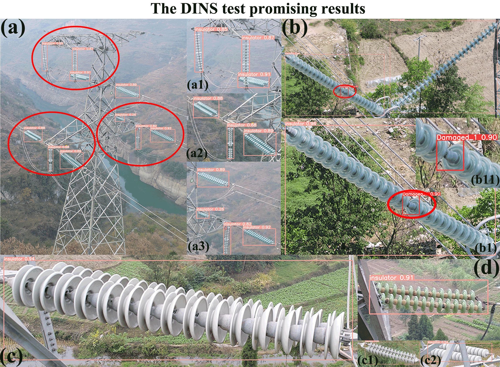

# DINs

This is the  Diverse Insulator Dataset (DID).  It is based on publicly available images of insulators. The complete dataset is available at https://drive.google.com/*/***

## Properties

DID has 1182 original insulator images containing three insulator types.

The 3121 bounding box annotations for object detection, the 1091 masks for instance segmentation, and the defects on insulators are  in the dataset. ***VOC*** meant that it was labeled in PASCAL VOC format while ***Mask*** represented that it only had mask marking information.  ***VOC***  contains defects, and the defects are augmented. We do not make defect masks.

### Compared with other datasets

### VOC

 We used ***labelImg***  to label the image with bounding boxes and tested it.

The results of the detection of DID 

Visualization based on YOLOv5

### Mask

 We used ***Lableme***  to mark the insulator outline and then generated mask images based on it.

The results of the instance segmentation of DID.

 

Visualization based on Mask-RCNN.

## Abstract

The insulator anomaly detection based on computer vision is fast, high-precision, standardized, and less expensive than manual detection, especially for massive inspection work. Nevertheless, public datasets are scarce and lack variety hampering research progress. Achieving industrial-grade accuracy in inspection still has a long way to go due to the scarcity of insulator datasets with actual complex scenes. We construct a comprehensive beyond the current insulator dataset – the Diverse Insulator Dataset (DID). DID has 1182 original insulator images containing three insulator types, i.e., porcelain, glass, and composite. The 3121 bounding box annotations for object detection, the 1091 masks for instance segmentation, and the defects on insulators are also in the dataset. We show that DID is much more scale and diversity than the current image datasets. Eventually, we illustrate the usefulness of DID through applications with 95.05\% mAP of object detection and 95.05\% mAP of instance segmentation. We also discuss the effective augmentation methods for insulators.
